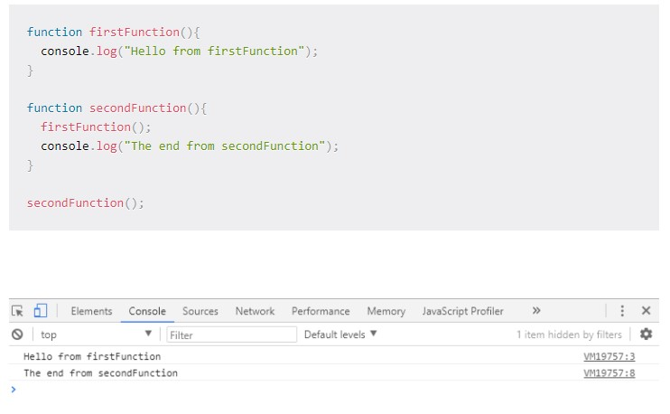

[<=== Back](/README.md)

# In Memory Storage

## Understanding the JavaScript Call Stack

**What is a ‘call’?**

A call is a function invocation.

**How many ‘calls’ can happen at once?**

One

**What does LIFO mean?**

Last In First Out

**Draw an example of a call stack and the functions that would need to be invoked to generate that call stack.**

**What causes a Stack Overflow?**

When a recursive function calls itself without an exit point

## JavaScript error messages

**What is a ‘reference error’?**

When you try to use a variable that has not yet been declared.

**What is a ‘syntax error’?**

An error in the syntax, such as commas, semi-colons, and brackets

**What is a ‘range error’?**

An error that occurs when trying to pass a value as an argument that does not all a range that includes the value.

**What is a ‘type error’?**

An error that occurs when the types you are trying to use or access are incompatible. Spelling errors are type errors.

**What is a breakpoint?**

A selected line of the code, where execution is paused.

**What does the word ‘debugger’ do in your code?**

Sets a breakpoint in the line where the debugger statement is made.

#### Bookmark and Review

[JavaScript errors reference on MDN](https://developer.mozilla.org/en-US/docs/Web/JavaScript/Reference/Errors)
