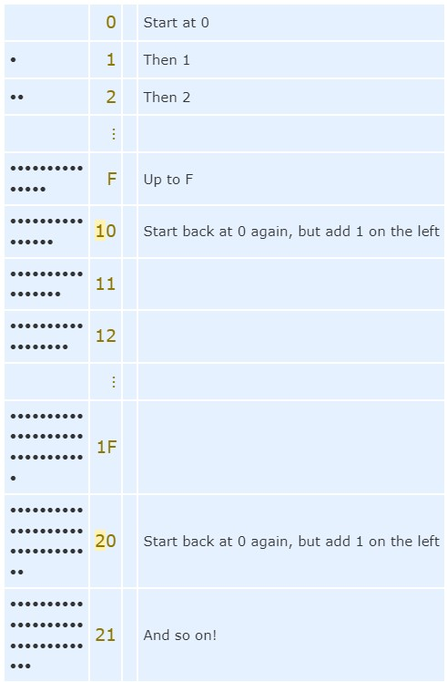

[<=== Back](README.md)

# Java Basics

## [Java OO Tutorial](https://docs.oracle.com/javase/tutorial/java/concepts/)
*from Oracle Java Documentation*

### Objects

Just like in the physical world, software objects have state (fields/variables) and behavior (methods/functions). 

> Methods operate on an object's internal state and serve as the primary mechanism for object-to-object communication. Hiding internal state and requiring all interaction to be performed through and object's methods is known as *data encapsulation* - a fundamental principle of object-oriented programming.

### Classes

> A class is a blueprint or prototype from which objects are created.

Just like in the physical world, software classes share common characteristics which are stored in fields or variables, and follow the same blueprint.


## [Java Classes](https://docs.oracle.com/javase/tutorial/java/javaOO/classes.html)
*from Oracle Java Documentation*

Example syntax:

```
public class Bicycle {
        
    // the Bicycle class has
    // three fields
    public int cadence;
    public int gear;
    public int speed;
        
    // the Bicycle class has
    // one constructor
    public Bicycle(int startCadence, int startSpeed, int startGear) {
        gear = startGear;
        cadence = startCadence;
        speed = startSpeed;
    }
        
    // the Bicycle class has
    // four methods
    public void setCadence(int newValue) {
        cadence = newValue;
    }
        
    public void setGear(int newValue) {
        gear = newValue;
    }
        
    public void applyBrake(int decrement) {
        speed -= decrement;
    }
        
    public void speedUp(int increment) {
        speed += increment;
    }       
}
```

# [Binary, Decimal, and Hexadecimal Numbers](https://www.mathsisfun.com/binary-decimal-hexadecimal.html)
*from Mathsisfun.com*

> The Decimal Number System is also called "Base 10", because it is based on the number 10, with the symbols 0,1,2,3,4,5,6,7,8 & 9

Any number can be used as the base.

### Binary

Binary is base 2, using the symbols 0 & 1.

1 = 1   
2 = 10   
3 = 11   
4 = 100   
5 = 101   
6 = 110   
7 = 111   
8 = 1000   
9 = 1001   
10 = 1010   

### Hexadecimal

Hexadecimal is base 16, using the symbols 0,1,2,3,4,5,6,7,8,9,A,B,C,D,E,F

Example:


