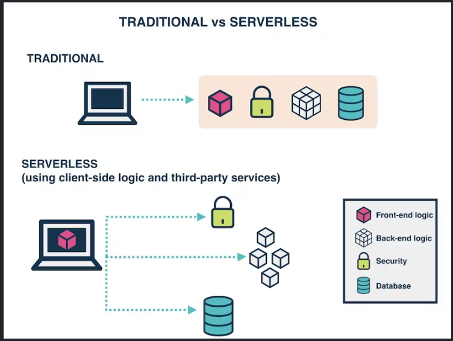

[<=== Back](../README.md)

# AWS

## [Intro to Serverless](https://hackernoon.com/what-is-serverless-architecture-what-are-its-pros-and-cons-cc4b804022e9)
*from Hackernoon*

### What is serverless?

> Serverless is a cloud computing execution model where the cloud provider dynamically manages the allocation and provisioning of servers. A serverless application runs in stateless compute containers that are event-triggered, ephemeral (may last for one invocation), and fully managed by the cloud provider. 



***Question: Describe “serverless” to a new 301 Code Fellows student.***

*"Serverless" architecture doesn't mean there are no servers. It means that you are not managing your own server, and are instead utilizing a 3rd party to handle your server...but it isn't a single server. When the server is used, the 3rd party directs that request appropriately.*

## [Graph QL](https://docs.amplify.aws/cli/graphql/data-modeling/)
*from Amplify Docs*

> Amplify CLI's GraphQL API category makes it easy for you to create a new GraphQL API backed by a database. Just define a GraphQL schema and Amplify CLI will automatically transform the schema into a fully functioning GraphQL API powered by AWS AppSync, Amazon DynamoDB, and more.

### Setting up GraphQL

`amplify add api`

```
? Select from one of the below mentioned services:
> GraphQL
? Here is the GraphQL API that we will create. Select a setting to edit or continue
> Continue
? Choose a schema template:
> Single object with fields (e.g., “Todo” with ID, name, description)
...
Edit your schema at <...>/schema.graphql or place .graphql files in a directory at <...>/schema
✔ Do you want to edit the schema now? (Y/n)
> yes
Edit the file in your editor: <...>/schema.graphql
✅ Successfully added resource new locally
```

Accept default values

`amplify push`

### Set up app code

`npm install aws-amplify`

In the app's entry point:

```
import { Amplify, API, graphqlOperation } from 'aws-amplify';
import awsconfig from './aws-exports';
Amplify.configure(awsconfig);
```

***Question: What is the benefit of using GraphQL? Any downsides?***

*The biggest benefit is the ease with which new types and fields can be added to the API. This allows features to be designed, developed, and deployed quickly.*

*The biggest downside is the query complexity - when multiple fields are accessed in one query, the varied resources and fields have to be retrieved from a data source.*

***Question: What makes an API RESTful?***

*A RESTful API is one that uses HTTP requests to access and use data. That data can be used to GET, PUT, POST, and DELETE data types (CRUD).*