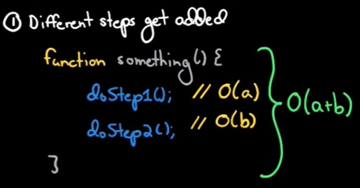
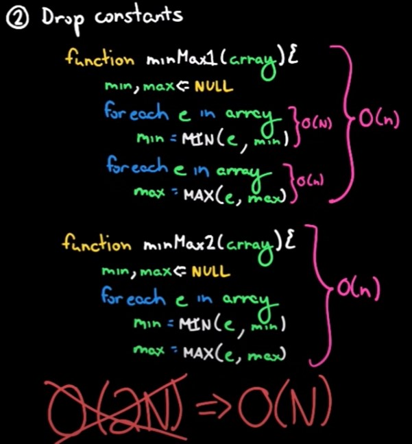
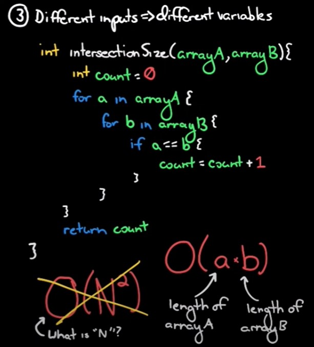
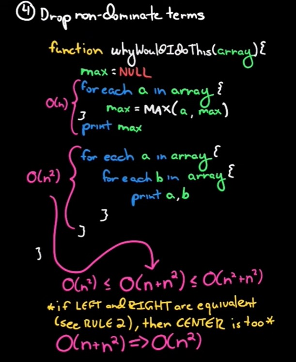

[<=== Back](../README.md)

# Data Structures and Algorithms

## [Recursion in Software Development](https://www.youtube.com/watch?v=vPEJSJMg4jY)
*from Manning Publication - YouTube*

Recursion is when a function calls itself, and is used when it makes the solution to the problem clearer and easier to understand. However, it is easy to write a recursive function that results in an infinite loop.

## [Data Structures you MUST know as a Software Developer](https://www.youtube.com/watch?v=sVxBVvlnJsM)
*from Aaron Jack - YouTube*

A Data Structure is a way of arranging data on a computer so that it can be accessed and updated.

Big O notation is a measure of how well a data structure scales - how long does it take?

**5 Most Important Data Structures**

- Linked List: Contains a value and a pointer (the *head* is the first node, which points to the next; the *tail* is the final node, with no pointer)
  - Really good at adding/deleting nodes, but not great at retreiving nodes

- Array: A continuous block of cells in the computer's memory
  - Really good at retreiving items, adding isn't always efficient

- Hash Table: Stores data in an associative manner using a key and a value. Memory locations don't have to be 'next to' each other
  - Two keys could refer to the same memory location. Good at retreiving and adding.

- Stack & Queue: Stack is last-in/first-out data structure / Queue is first-in/first-out
  - Efficient but have limited use cases

- Graphs & Trees: Graphs are similar to a linked list / Trees are types of graphs
  - Efficient at searching, but can become 'unbalanced'

## [Basic Data Structures](https://towardsdatascience.com/8-common-data-structures-every-programmer-must-know-171acf6a1a42) 
*by: Vijini Mallawaarachchi*

**8 Common Data Structures Every Programmer Must Know*

**Arrays**

**Linked Lists**
- Singly Linked Lists: Traversal can be done only in the forward direction
- Doubly Linked Lists: Traversal can be done forward and backward - nodes have an additional pointer (`prev`)
- Circular Linked Lists: The `prev` pointer of the head points to the tail / the `next` pointer of the tail points to the head

**Stacks**
- Used to implement function calls in recursion programming

**Queues**

**Hash Tables**
- The **hash function (h)** is used:
  `h(k) = k % m`

  *h*: Hash function
  *k*: Key of the has value
  *m*: Size of the hash table (number of slots available)

- Used to implement database indexes, associative arrays, and the "set" data structure

**Trees**
- Binary trees are organized in a hierarchical structure where nodes contained in subtrees to the *left* of a node are less than the parent node, and nodes contained in subtrees to the *right* of a node are greater than the parent node.

**Heaps**
> "A **heap** is a special case of a binary tree where the parent nodes are compared to their children with the values and are arranged accordingly. Heaps can be represented using trees as well as arrays.

- Min Heap - The key of the parent is <= those of its children
- Max Heap - The key of the parent is >= those of its children

**Graphs**
> A graph consists of a finite set of **vertices** or nodes and a set of **edges** connecting these vertices. The **order** of the graph is the number of vertices in the graph. The **size** of the graph is the number of edges in the graph. Two nodes are **adjacent** if they are connected to each other by the same edge.

- Used to represent social media networks, web pages and links by search engines, and locations and routes in GPS.

## [Big O Explained](https://www.youtube.com/watch?v=v4cd1O4zkGw)
*from Hacker Rank - YouTube*

Big O is also known as *algorithmic efficiency*. Hot time scales with respect to some input variables.

O(1) refers to Constant Time - the time required for the data transfer does not change based on it's size (carrier pigeon example)
O(n) scales linearly with respect to the amount of input - twice the data requires twice the time. ('n' is just a variable)

**Four Important Rules**
1. Different steps are added 
  

2. Drop constants
  

3. Different Inputs => Different Variables
  

4. Drop Non-Dominant Terms
  

## [Why BigO?](https://triplebyte.com/blog/why-you-should-learn-big-o-and-stop-hacking-your-way-through-algorithms)
*from "Why you should lean Big-O and stop hacking your way through algorithms" by Joseph Pacheco*

The entire purpose of algorithms is to ensure that code runs in a reasonable amount of time, and take up a reasonable amount of space. Big-O allows us a mathematical representation of the efficiency of an algorithm, and important to actually understand, and not just to gloss over as 'something else to memorize'. 

> "... if you think about time and space as separate, “add-on” details, they lose their meaning. If you think about algorithms without reference to time and space (as arbitrary sets of instructions), they lose their meaning. If you think about them together, as two critical parts of the same narrative, everything becomes interesting."

**Discussion Questions**

- *What is one of the most important things you should consider when deciding which data structure is best suited to solve a particular problem?*
  - One of the most important things to consider is the time and space complexity of the problem and of the solution.

- *How can we ensure that we'll avoid an infinite recursive call stack?*
  - Be sure to tell the function when to stop running - give the function a 'base case'.