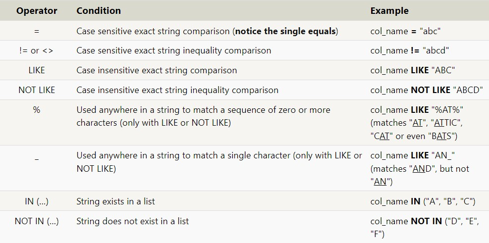
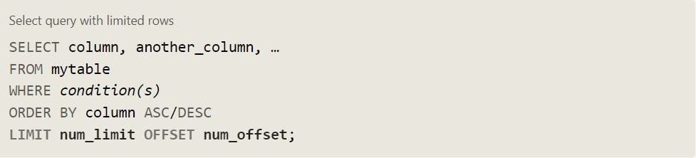
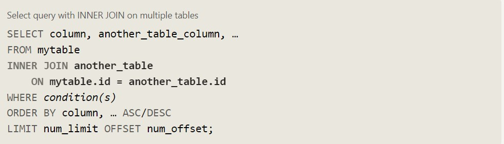
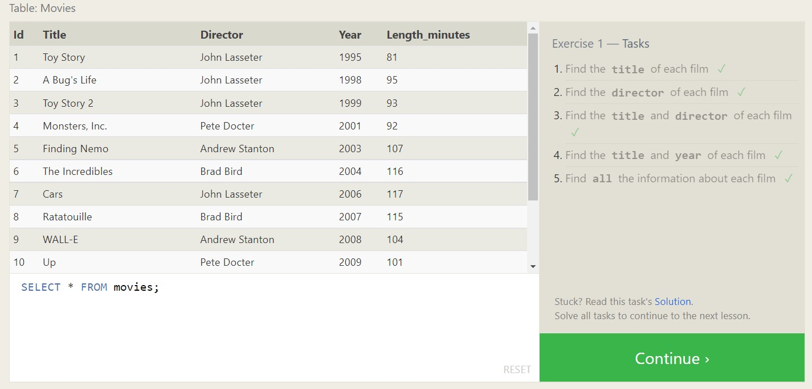
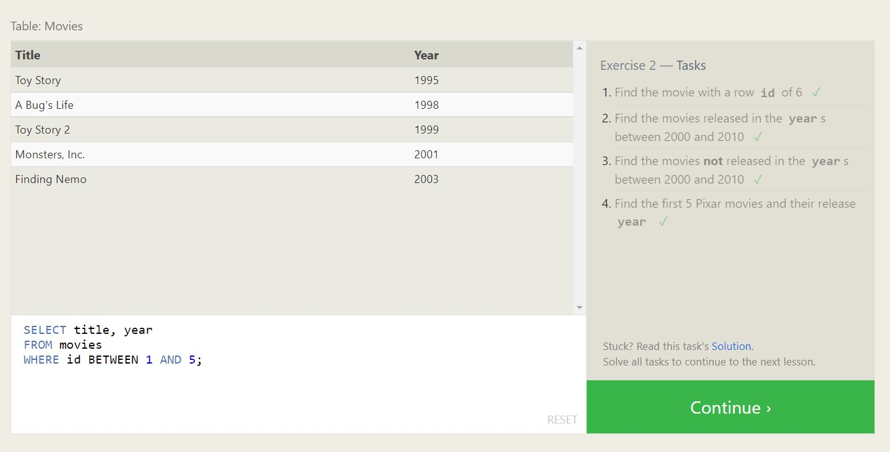
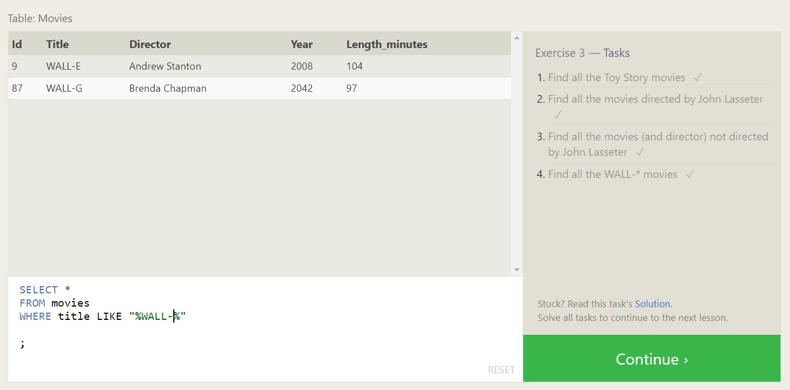
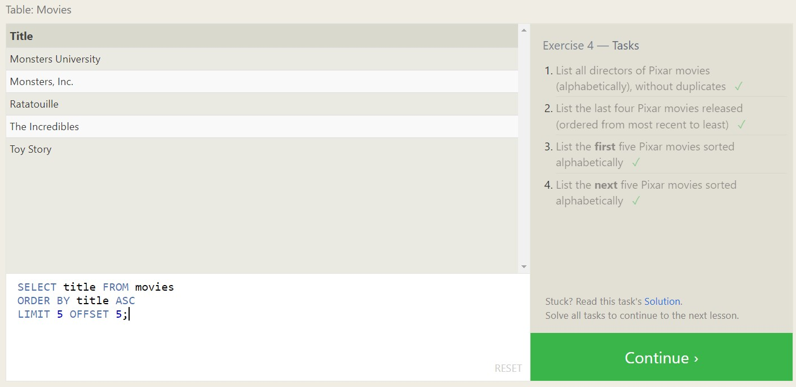
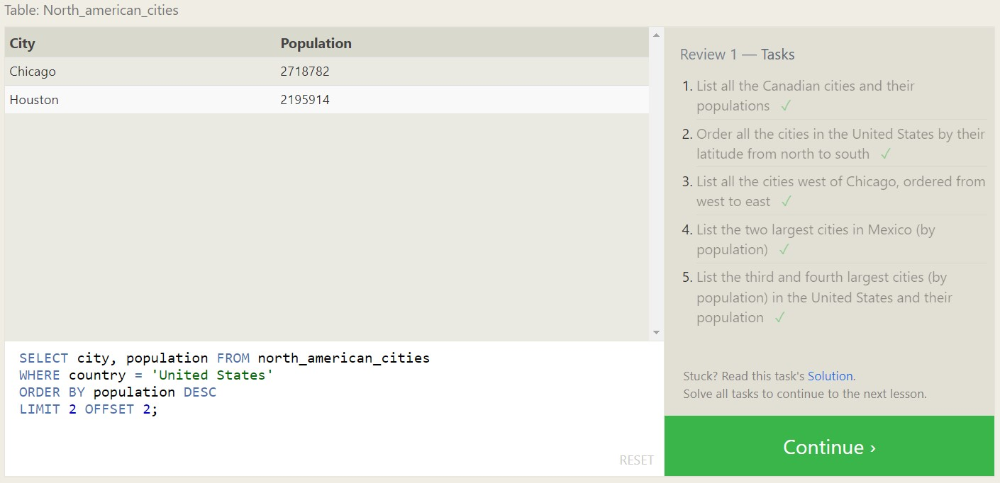
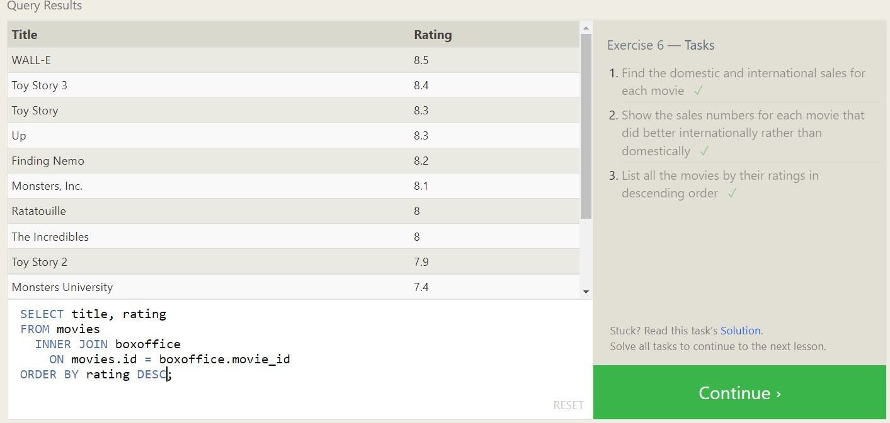

[<=== Back](README.md)

# Learning SQL

## Learn SQL 
*by Dave Fowler*

SQL stands for Structured Query Language
> "Simply put, it's a search language for you to instruct a database about what information you'd like retrieved from it."

## SQL Bolt

Queries to a SQL database are also known as 'SELECT' statements.

Using `SELECT *``from some_table` will yield the entirety of `some_table`.

To query multiple columns from a table, separate column ids with a comma:

`SELECT title, director`

When specific conditions for data need to be met before the data is returned, a WHERE clause can be used:

```
  SELECT column, another_column, …
  FROM mytable
  WHERE condition
      AND/OR another_condition
      AND/OR …;

```

WHERE clauses can also be used for string comparison and pattern matching:



Query results can also be filtered and arranged using the 'DISTINCT', 'ORDER BY', 'LIMIT' AND 'OFFSET' keywords.



#### Database Normalization

- Minimizes duplicate data in a single table
- Allows data to grow independently of other data tables
- Queries can be more complex
- Performance issues may occur with large data sets

Data from two separate tables can be combined with the JOIN clause:



### SQL Query Practice Screenshots

   



