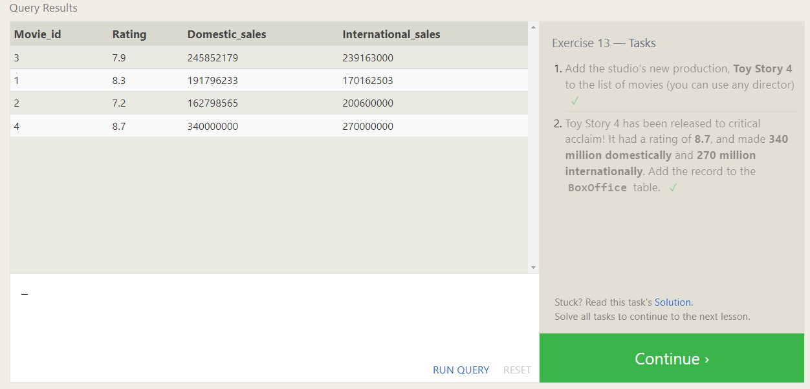
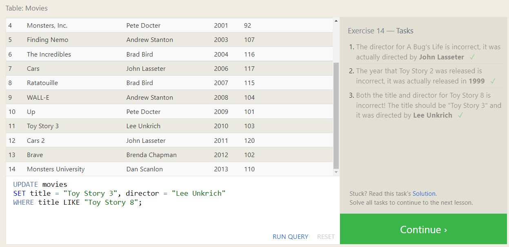
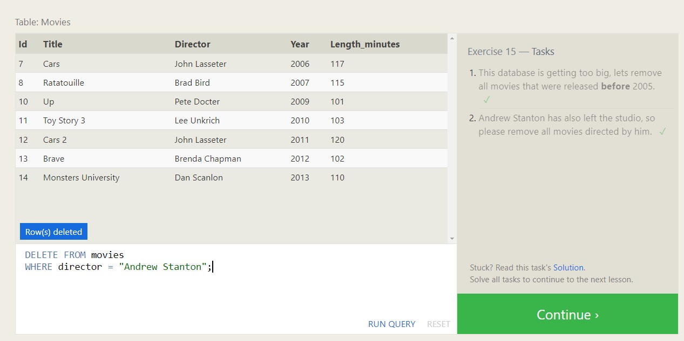
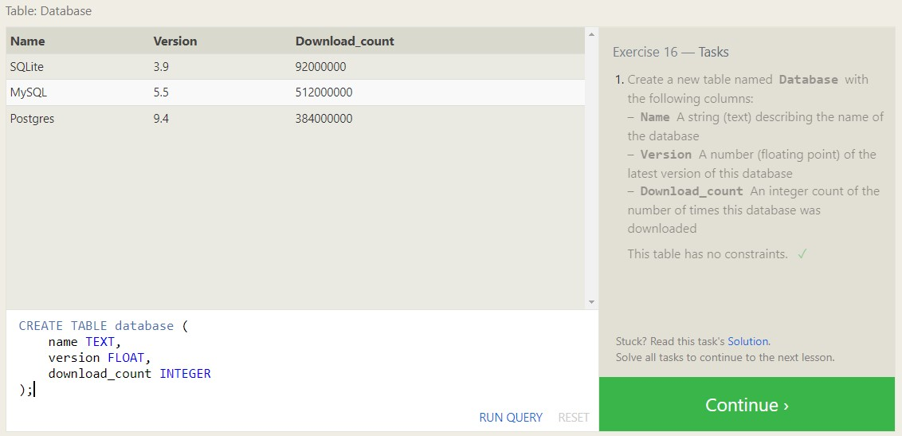
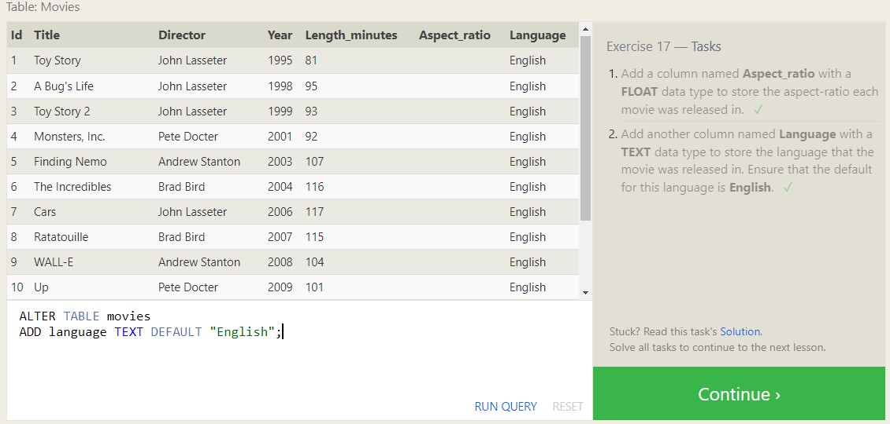
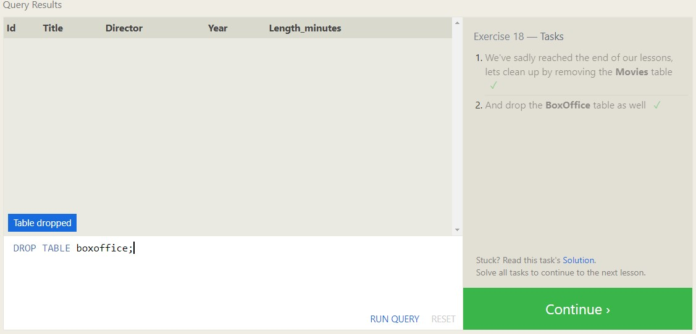

[<=== Back](README.md)

# Learning SQL

## Learn SQL 
*by Dave Fowler*

SQL stands for Structured Query Language
> "Simply put, it's a search language for you to instruct a database about what information you'd like retrieved from it."

## [SQL Bolt](https://sqlbolt.com/lesson/introduction)

### Queries

Queries to a SQL database are also known as 'SELECT' statements.

Using `SELECT *``from some_table` will yield the entirety of `some_table`.

To query multiple columns from a table, separate column ids with a comma:

`SELECT title, director`

When specific conditions for data need to be met before the data is returned, a WHERE clause can be used:

```
  SELECT column, another_column, …
  FROM mytable
  WHERE condition
      AND/OR another_condition
      AND/OR …;

```

WHERE clauses can also be used for string comparison and pattern matching:


Query results can also be filtered and arranged using the 'DISTINCT', 'ORDER BY', 'LIMIT' AND 'OFFSET' keywords.


#### Database Normalization

- Minimizes duplicate data in a single table
- Allows data to grow independently of other data tables
- Queries can be more complex
- Performance issues may occur with large data sets

Data from two separate tables can be combined with the JOIN clause:


#### SQL Query Practice Screenshots

   


### Database Management

Rows of data can be inserted into a table by using `INSERT INTO table_name`, or into specific columns by using `INSERT INTO table_name (column, another_column)`, followed by the values to be inserted.

---

Rows of data may also be updated by using `UPDATE table_name SET column = value_or_expression WHERE condition;`. Excluding WHERE will update all rows!
To avoid updating mistakes, write the constraint first, and test with a SELECT query.

---

Rows of data bay be deleted by using `DELETE FROM table_name WHERE condition`.

New tables of data can be created by using:

```
CREATE TABLE IF NOT EXISTS newtable (
  column DataType TableConstraint DEFAULT default_value, 
  another_column DataType TableConstraint DEFAULT default_value,
  ...
);
```
---

To add, remove, or modify columns and tables, use:

```
ALTER TABLE table_name
ADD column DataType OptionalTableConstraint
  DEFAULT default_value
DROP column_to_be_deleted
RENAME TO new_table_name;
```

*There are different methods of altering table depending on the database implementation, be sure to check documentation!*

---

In order to remove a table, including all of its data and metadata use:

`DROP TABLE IF EXISTS table_name`

*If other tables depend on the table you are deleting, you will have to either update all dependent tables or remove those tables.*

#### SQL Database Management Practice Screenshots

   
