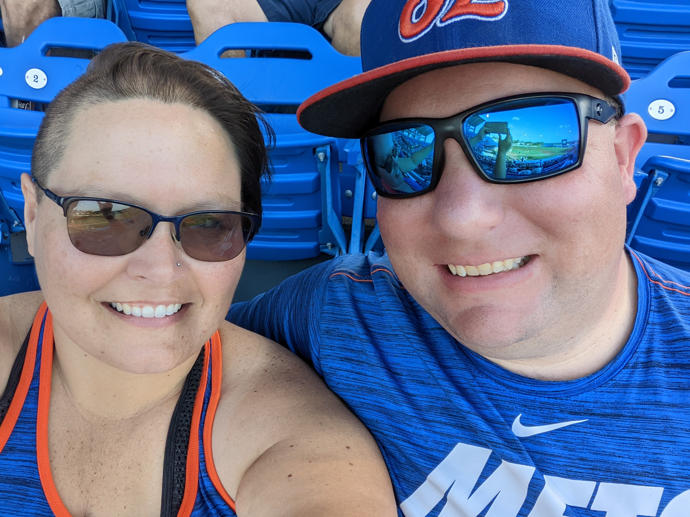

# Reading Notes for Code Fellows

## About Me
My name is Mandy Mason, and before I started Code Fellows, I had no coding experience! I spent the last eight years as a K-12 Music teacher, and am making a career change to the tech industry. I was born in Nashville,TN and lived around the Middle Tennessee area for most of my life.  My husband Daniel, our cat Gizmo, and I moved to Port Saint Lucie, FL in December of 2018. We enjoy learning new things, playing games, watching sports, and spending time with our friends. 

[Click to view my GitHub portfolio page!](https://github.com/mnmason86?tab=projects&type=beta)

 

### What is a Growth Mindset?

When I read about growth mindset, I start out by thinking "That's me! I do those things!", however there is always room for improvement. Not only does growth mindset refer to being open to the ideas of others, always being willing to learn something new, and the ability to look inward on your own achievements and failures, but also to recognize where those improvements can be made. Like most of us these days, I am highly susceptible to the need for instant gratification. Sometimes this works as a positive - a burst of dopamine for completing even the smallest of assigned tasks! *Hooray!* Other times, it is so easy to get distracted from a larger, more complex task or assignment. *Boo!* I believe the key to staying on track and in that growth mindset when those temptuous distractions loom just out of my field of vision, is to focus on the big picture, and know that perseverence will lead to greater reward.

#### How I will keep myself in a growth mindset:

- Keep the desire to learn constantly
- Accept constructive criticism 
- Accept my failures as learning opportunities
- Focus on the big picture

<h3 style="display:block;
           margin-left: auto;
           margin-right:auto;
           text-align: center;">
  Table of Contents</h3>

| Code 102 Intro to Software Development | Code 201 Foundations of Software Development | Code 301 Intermediate Software Development | Code 401 Advanced Software Development |
| :--------------------------------: | :--------------------------------: | :--------------------------------: | :--------------------------------: |
|[Class 01 Reading](102/102class01reading.md)|[Class 01 Reading](201/201class01reading.md)|[Class 01 Reading](301/301class01reading.md)|[Growth Mindset](401/GrowthMindset.md)|   
|[Class 02 Reading](102/102class02reading.md)|[Class 02 Reading](201/201class02reading.md)|[Class 02 Reading](301/301class02reading.md)|[Learning SQL](401/LearningSQL.md)|   
|[Class 03 Reading](102/102class03reading.md)|[Class 03 Reading](201/201class03reading.md)|[Class 03 Reading](301/301class03reading.md)|[The Command Line](401/CommandLine.md)|
|[Class 04 Reading](102/102class04reading.md)|[Class 04 Reading](201/201class04reading.md)|[Class 04 Reading](301/301class04reading.md)|[Data Structures and Algorithms](401/DSA.md)|
|[Class 05 Reading](102/102class05reading.md)|[Class 05 Reading](201/201class05reading.md)|[Class 05 Reading](301/301class05reading.md)|[Engineering](401/Engineering.md)|
|[Class 06 Reading](102/102class06reading.md)|[Class 06 Reading](201/201class06reading.md)|[Class 06 Reading](301/301class06reading.md)|[Class 01 Reading](401/401class01reading.md)|
|[Class 07 Reading](102/102class07reading.md)|[Class 07 Reading](201/201class07reading.md)|[Class 07 Reading](301/301class07reading.md)|[Class 02 Reading](401/401class02reading.md)|
|[Class 08 Reading](102/102class08reading.md)|[Class 08 Reading](201/201class08reading.md)|[Class 08 Reading](301/301class08reading.md)|[Class 03 Reading](401/401class03reading.md)|
|                                            |[Class 09 Reading](201/201class09reading.md)|[Class 09 Reading](301/301class09reading.md)|[Class 04 Reading](401/401class04reading.md)|
|                                            |[Class 10 Reading](201/201class10reading.md)|[Class 10 Reading](301/301class10reading.md)|[Class 05 Reading](401/401class05reading.md)|
|                                            |[Class 11 Reading](201/201class11reading.md)|[Class 11 Reading](301/301class11reading.md)|[Class 06 Reading](401/401class06reading.md)|
|                                            |[Class 12 Reading](201/201class12reading.md)|[Class 12 Reading](301/301class12reading.md)|[Class 07 Reading](401/401class07reading.md)|
|                                            |[Class 13 Reading](201/201class13reading.md)|[Class 13 Reading](301/301class13reading.md)|[Class 08 Reading](401/401class08reading.md)|
|                                            |[Class 14 Reading](201/201class14reading.md)|[Class 14 Reading](301/301class14reading.md)|[Class 09 Reading](401/401class09reading.md)|
|                                            |                                            |[Class 15 Reading](301/301class15reading.md)|[Class 10 Reading](401/401class10reading.md)| 
|                                            |                                            |                                            |[Class 11 Reading](401/401class11reading.md)|
|                                            |                                            |                                            |[Class 12 Reading](401/401class12reading.md)|
|                                            |                                            |                                            |[Class 13 Reading](401/401class13reading.md)|
|                                            |                                            |                                            |[Class 14 Reading](401/401class14reading.md)|
|                                            |                                            |                                            |[Class 15 Reading](401/401class15reading.md)|                                      
|                                            |                                            |                                            |[Class 16 Reading](401/401class16reading.md)|
|                                            |                                            |                                            |[Class 17 Reading](401/401class17reading.md)|
|                                            |                                            |                                            |[Class 18 Reading](401/401class18reading.md)|
|                                            |                                            |                                            |[Class 26 Reading](401/401class26reading.md)|
|                                            |                                            |                                            |[Class 27 Reading](401/401class27reading.md)|
|                                            |                                            |                                            |[Class 28 Reading](401/401class28reading.md)|

## Things I Want To Know More About

